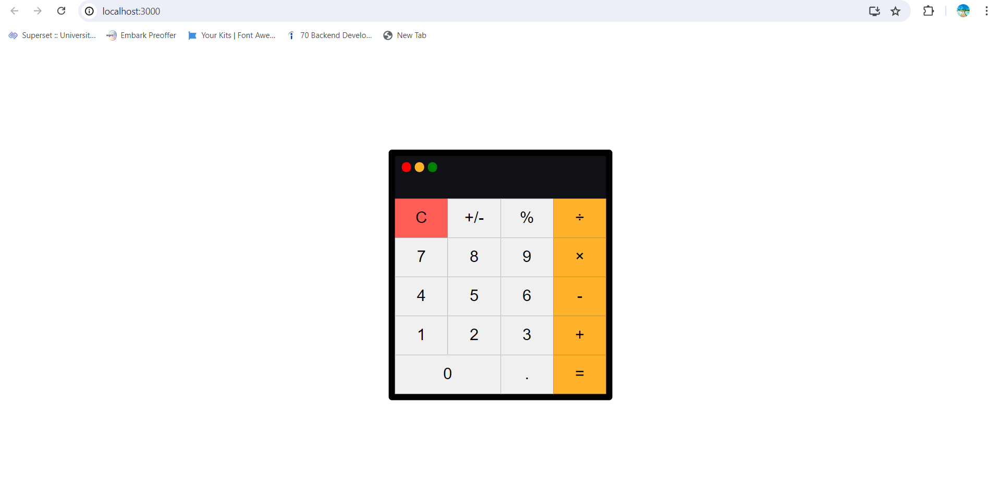

# Calculator Using React.js
___

___
## Overview 

A simple Calculator created using React.js
___

## Live Demo

- **Live Deployed Link:-** <a href="https://reactoperator.netlify.app/" target="_blank">Live</a>

[](https://app.netlify.com/sites/reactoperator/deploys)

## Features

- Perform Arithmetic Operations like Addition, Subtraction, Multiplication and Division.
- Additionally, can also perform operations like percentage and plusminus.

## Technologies Used

[](https://skillicons.dev)

- **React.js:** Front-end JavaScript library for building user interfaces.
- **CSS Modules:** Modular CSS files scoped locally to each component.

___

## Installation

To run this project locally, follow these steps:

1. Clone the repository:

   ```bash
   git clone https://github.com/MdIrfan-ul/Calculator.git
   ```
2. Navigate to the Project Directory:
```bash
   cd calculator
   ```
   
3. Install Dependencies:

 ```bash
     npm install
 ```

4. Start the development server:

```bash
npm start
```
5. Open your browser and navigate to http://localhost:3000 to view the application.

___

Developed with ❤️ by [Mohamed Irfanullah M]

___